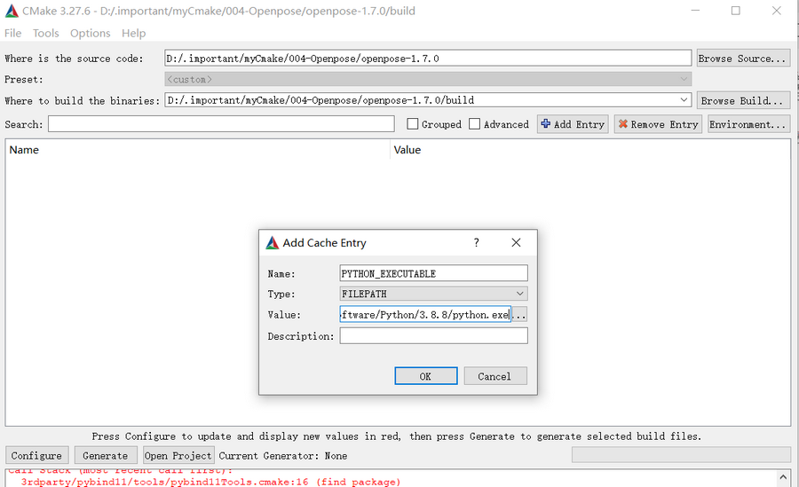

# 安装使用openpose 和 pyopenpose(无需编译)
* ```
    OpenPose是一个开源计算机视觉库，用于进行人体姿势估计。
    它能够从图像或视频中检测和跟踪人体的关键点，如头部、手臂、腿部等，以及估计人体的姿势。
    总之，OpenPose是一个用于人体姿势估计的开源库，而PyOpenPose是它的Python绑定库，
    通过PyOpenPose可以在Python环境中方便地使用OpenPose的功能。

## 构建操作
* ```
    openpose目前最新版1.7.0
    openpose的GitHub大部分资源已经脱机，无法下载。
    使用已打包好的资源即可。
    本例使用1.7.0的资源包(2.2G)进行演示
* `openpose环境`
* ```
    GPU版 需要NVIDIA显卡，对应驱动，CUDA编译器(nvcc)，cuDNN(深度神经网络库，与nvcc对应)
    python
    cmake(cmake-gui)
    visual studio
* ```
    本机配置 win10、python3.8.8(64位)、cmake3.27.6、nvcc V12.2.91、cudnn 8.9.4、visual studio
### 构建开始
* ```
    # 解压后目录
        d-----         2021/5/29     19:39                .github
        d-----         2021/5/29     19:39                3rdparty
        d-----         2021/5/29     19:39                build
        d-----         2021/5/29     19:39                cmake
        d-----         2021/5/29     19:39                doc
        d-----         2021/5/29     19:39                examples
        d-----         2021/5/29     19:39                include
        d-----         2021/5/29     19:39                models
        d-----         2021/5/29     19:39                python
        d-----         2021/5/29     19:39                scripts
        d-----         2021/5/29     19:39                src
        -a----        2020/11/17     13:48           2351 .gitignore
        -a----        2020/11/17     13:48            221 .gitmodules
        -a----        2020/11/17     13:48           5413 .travis.yml
        -a----        2020/11/17     13:48           1427 appveyor.yml
        -a----        2020/11/17     13:48          43800 CMakeLists.txt
        -a----        2020/11/17     13:48           9686 LICENSE
        -a----        2020/11/17     13:48          16504 README.md
    
* `清空build文件夹，打开cmake-gui，定位source code地址和binary build地址。`
* 如果存在多个python解释器，点击 `Add entry`，指定`python3.8.8`的路径，`目前支持3.8.8，3.10.6不行`。
* 
* 再点击 `Configure`，generator 选择`visual studio x`，在选择 `x64`，完事点击 `finish`。
* 因为需要构建pyopenpose，勾选 `BUILD_PYTHON`，再点击 `configure`，之后继续点击 `generate`。
* 以上步骤没有弹窗报错，即可点击 `Open Project`。
* 在 visual studio中点击 `生成解决方案(B)`，等待编译...
* ```
    # 编译后的操作，cmd进入 build 文件夹
        xcopy /s /y x64\Debug\* bin\
        xcopy /s /y bin\* python\openpose\Debug\
        cd ..\examples\tutorial_api_python\
        python 01_body_from_image.py    # 注意python 一定是3.8.x版本。
    # 出现带有骨架的窗口即可完成。
    # 需要注意 py中两行代码，才可正确导入 pyopenpose库
        sys.path.append(dir_path + '/../../build/python/openpose/Debug');
        os.environ['PATH']  = os.environ['PATH'] + ';' + dir_path + '/../../build/x64/Debug;' +  dir_path + '/../../build/bin;'

* [更多使用请看](https://github.com/CMU-Perceptual-Computing-Lab/openpose)